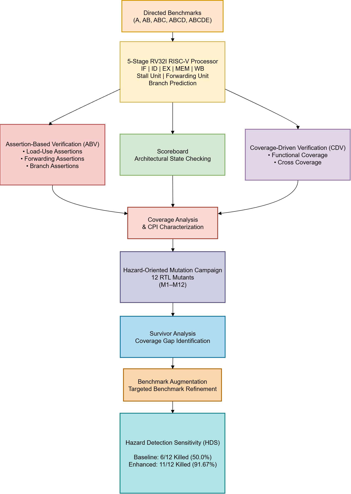
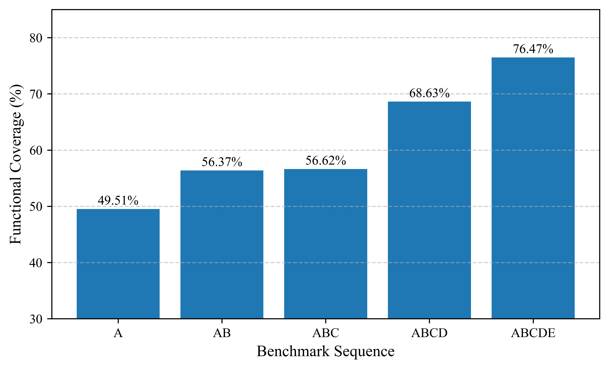
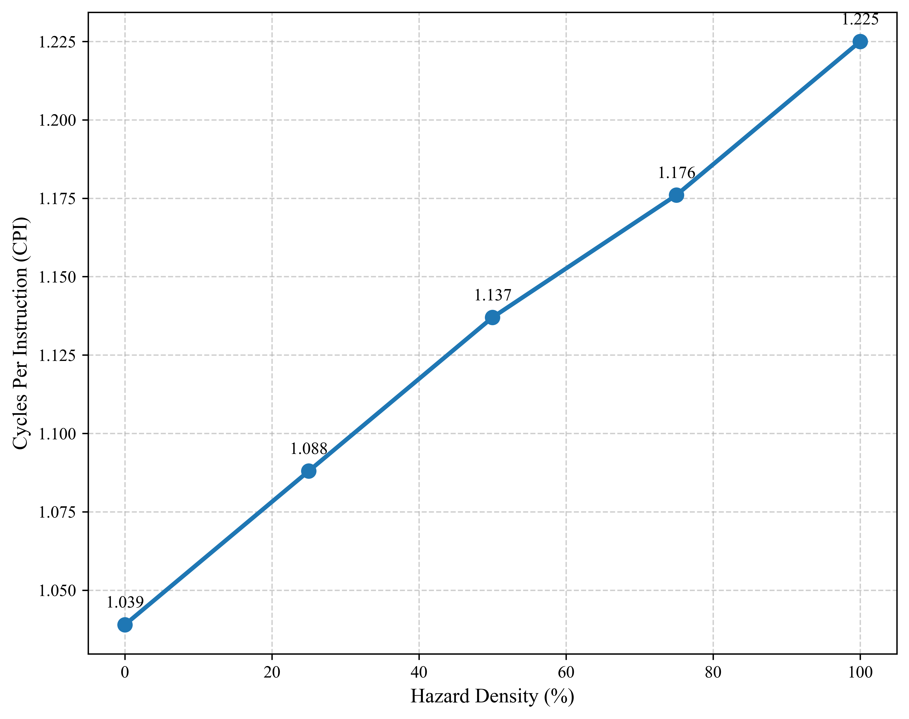
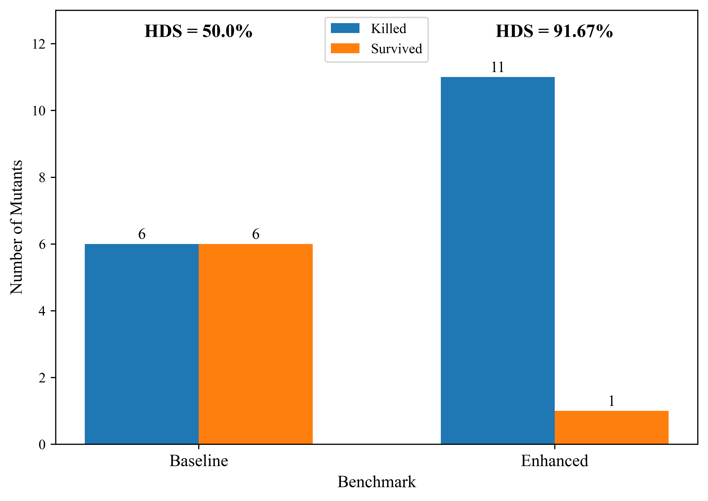

# Hybrid ABV-CDV Verification of a 5-Stage RV32I RISC-V Processor


## Overview

This repository contains the RTL implementation and hybrid verification framework for a **5-stage pipelined RV32I RISC-V processor**. The project focuses on verifying hazard handling logic using a combination of **Assertion-Based Verification (ABV)**, **Coverage-Driven Verification (CDV)**, directed benchmarks, mutation testing, and the proposed **Hazard Detection Sensitivity (HDS)** metric.

The processor implements the classic IF-ID-EX-MEM-WB pipeline with hazard detection, data forwarding, branch prediction, and load-use stall handling. The verification environment evaluates both functional correctness and performance through functional coverage, mutation analysis, and CPI characterization.

---

## Key Features

### RTL Design

* **5-Stage RV32I Pipeline:** Instruction Fetch (IF), Instruction Decode (ID), Execute (EX), Memory (MEM), and Write Back (WB).
* **Hazard Detection Unit:** Detects load-use hazards and inserts pipeline stalls when forwarding cannot resolve dependencies.
* **Forwarding Unit:** Supports EX-EX and MEM-EX forwarding paths to minimize unnecessary stalls.
* **Branch Handling:** Static branch prediction with pipeline flushing on branch misprediction.

### Verification Environment

* **Hybrid Verification:** Combines Assertion-Based Verification (ABV) with Coverage-Driven Verification (CDV).
* **SystemVerilog Assertions:** Concurrent assertions verify hazard detection, forwarding, pipeline stalls, and control hazard behavior.
* **Functional Coverage:** Covergroups monitor hazard scenarios, forwarding paths, branch behavior, predictor transitions, and cross-coverage interactions.
* **Scoreboard:** Performs architectural register checking against a golden reference model.
* **Directed Benchmarks:** Progressive benchmark suite designed to systematically exercise pipeline hazards.

### Mutation Testing

* **Hazard-Oriented Mutation Campaign:** Twelve RTL mutants targeting stall and forwarding logic.
* **Coverage-Guided Benchmark Refinement:** Survivor analysis used to generate targeted benchmarks.
* **Hazard Detection Sensitivity (HDS):** Quantifies the effectiveness of the verification environment through mutation detection.

---

## Verification Results

| Metric                      |      Result |
| --------------------------- | ----------: |
| Overall Functional Coverage |  **76.47%** |
| Primary Hazard Coverpoints  |    **100%** |
| Cross Coverage              |  **38.89%** |
| Baseline HDS                |  **50.00%** |
| Enhanced HDS                |  **91.67%** |
| RTL Mutants Injected        |      **12** |
| Mutants Killed (Baseline)   |  **6 / 12** |
| Mutants Killed (Enhanced)   | **11 / 12** |

### Final Functional Coverage

| Coverpoint            |   Coverage |
| --------------------- | ---------: |
| EX-EX Hazards         |   **100%** |
| MEM-EX Hazards        |   **100%** |
| Load-Use Hazards      |   **100%** |
| Forward A             |   **100%** |
| Forward B             |   **100%** |
| Branch Evaluation     |   **100%** |
| Branch Misprediction  |   **100%** |
| BHT State Transitions |   **100%** |
| Cross Coverage        | **38.89%** |

---

## Results

### Verification Flow

<p align="center">
  
</p>

> *Illustrates the complete hybrid verification methodology. Directed benchmarks are executed on the 5-stage RV32I processor and evaluated using assertions, scoreboard checking, and functional coverage. Mutation testing, survivor analysis, and benchmark refinement are subsequently performed to evaluate Hazard Detection Sensitivity (HDS).*

---

### Functional Coverage Progression

<p align="center">
  
</p>

> *Shows the progression of functional coverage as additional directed benchmarks are introduced. Coverage increases from 49.51% to 76.47%, demonstrating systematic coverage closure through benchmark refinement while achieving complete coverage of all primary hazard-related behaviors.*

---

### CPI Characterization

<p align="center">
  
</p>

> *Illustrates the impact of increasing load-use hazard density on processor performance. As hazard frequency increases, additional stall cycles are introduced, resulting in a gradual increase in CPI while maintaining correct architectural execution.*

---

### Hazard Detection Sensitivity (HDS)

<p align="center">
  
</p>

> *Demonstrates the effectiveness of coverage-guided benchmark refinement. Hazard Detection Sensitivity (HDS) improves from 50.00% to 91.67%, increasing the number of detected RTL mutants from 6 to 11 out of the 12 injected hazard-oriented mutations.*

---

## Project Structure

```text
RISCV-HYBRID-VERIFICATION
├── rtl/
│   ├── core/
│   └── hazard_units/
├── tb/
│   ├── assertions/
│   ├── coverage/
│   ├── tests/
│   ├── scoreboard.sv
│   └── tb_core.sv
├── scripts/
├── images/
├── docs/
├── .gitignore
└── README.md
```

---

## Tools Used

* SystemVerilog
* Verilator
* GTKWave
* Vivado
* Yosys
* Python

---

## Documentation

Detailed project documentation is available in the `docs/` directory.

- 📄 [Hardware Architecture Specification](docs/architecture.md) – Overview of the 5-stage RV32I pipeline, hazard detection unit, forwarding unit, branch handling, and RTL organization.
- 📄 [Verification Plan](docs/verification_plan.md) – Description of the hybrid ABV-CDV verification environment, functional coverage strategy, mutation campaign, and HDS evaluation methodology.

These documents provide additional details on the processor architecture and verification methodology used throughout this project.